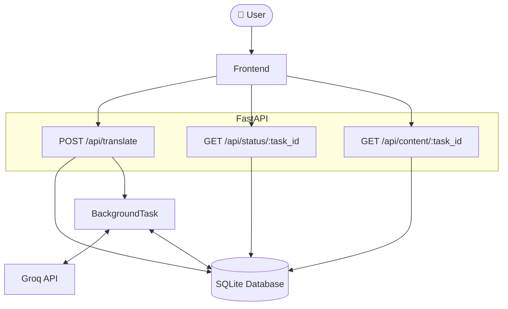

# Translation Service

A FastAPI-based translation service that provides asynchronous text translation using AI models.

## Description

This application allows users to translate text into multiple languages simultaneously. It features a web interface for easy interaction and uses background tasks to handle translation requests asynchronously. The service integrates with Groq's API to provide high-quality translations using the Gemma2-9B-IT model.

## Tech Stack

- **Backend**: FastAPI
- **Frontend**: HTML, TailwindCSS, JavaScript
- **AI/ML**: OpenAI SDK with Groq API
- **Database**: SQLite
- **ORM**: SQLModel
- **Task Queue**: FastAPI BackgroundTasks
- **Configuration**: Pydantic Settings
- **Templates**: Jinja2

## Application Flow



## Quick Start

1. Clone the repository
   
   ```bash
   git clone https://github.com/k0msenapati/translation-service
   ```

2. Install dependencies: `uv sync`
3. Activate Environment: `source .venv/bin/activate`
4. Set up environment variables in `.env`
5. Run the application: `fastapi dev app/main.py`
6. Open your browser to `http://localhost:8000`

